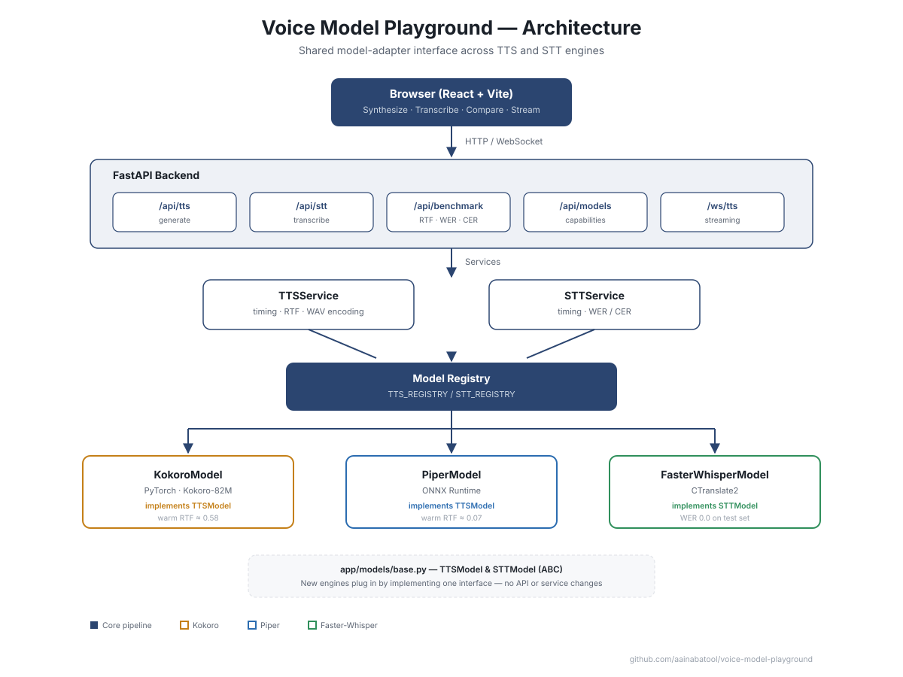

# Voice Model Playground

A local-first playground for comparing text-to-speech and speech-to-text models, with real benchmarking (latency, RTF, WER, CER) and WebSocket-based streaming synthesis.

Built incrementally to demonstrate a clean, extensible model-adapter architecture: adding a new TTS or STT engine requires implementing one interface and registering it - no changes to API routes or frontend logic.

## Features

- **Text-to-Speech**: two engines (Kokoro-82M, Piper) behind a shared interface, selectable per request
- **Speech-to-Text**: Faster-Whisper transcription with language and duration detection
- **Benchmarking**: real-time factor (RTF), word/character error rate (WER/CER) against a reference transcript, and generation timing
- **Model Comparison**: run identical input through every registered TTS engine and compare speed side by side
- **Streaming**: WebSocket endpoint delivers audio sentence-by-sentence as it's generated, rather than waiting for the full synthesis to complete
- **Tests**: pytest suite covering the model registry, error handling, and a real end-to-end synthesis check

## Architecture



Every model adapter implements a shared abstract interface (`TTSModel` / `STTModel` in `app/models/base.py`), so the API layer never depends on model-specific details. Registering a new engine is a two-step change: implement the interface, add it to the registry dict.

## Tech Stack

- **Backend**: Python 3.12, FastAPI, uv (dependency management)
- **TTS**: [Kokoro-82M](https://huggingface.co/hexgrad/Kokoro-82M) (PyTorch), [Piper](https://github.com/OHF-Voice/piper1-gpl) (ONNX)
- **STT**: [Faster-Whisper](https://github.com/SYSTRAN/faster-whisper) (CTranslate2)
- **Frontend**: React + Vite
- **Metrics**: jiwer (WER/CER)
- **Testing**: pytest, httpx

## Getting Started

### Prerequisites

- Python 3.12+
- [uv](https://docs.astral.sh/uv/)
- Node.js 20+ and npm
- [espeak-ng](https://github.com/espeak-ng/espeak-ng) (required by Kokoro; Windows users need this on PATH manually - the MSI installer does not add it)

### Backend

```bash
cd backend
uv sync
uv run uvicorn app.main:app
```

> **Note (Windows):** don't use `--reload` when the STT endpoint is in use - it causes the server to hang indefinitely due to a conflict between the reloader's file-watcher subprocess and CTranslate2's threading. Use plain `uv run uvicorn app.main:app` and restart manually after backend code changes.

The API will be running at `http://127.0.0.1:8000`. Interactive docs at `http://127.0.0.1:8000/docs`.

### Frontend

```bash
cd frontend
npm install
npm run dev
```

Open `http://localhost:5173`.

### Running Tests

```bash
cd backend
uv run pytest -v
```

## Benchmark Results

Measured on a local CPU-only Windows machine (no GPU), warm (post-model-load) runs:

| TTS Model | RTF (lower is faster) |
|-----------|------------------------|
| Piper     | ~0.07-0.08             |
| Kokoro    | ~0.58-0.61             |

Piper is roughly 7-9x faster than Kokoro on this hardware - expected, given Piper's lightweight ONNX architecture versus Kokoro's PyTorch/transformer-based pipeline. Both run comfortably faster than real-time (RTF < 1.0).

STT (Faster-Whisper, `tiny` model) achieved WER = 0.0 and CER = 0.0 on short test sentences fed back from generated TTS audio.

## API Overview

| Endpoint | Method | Description |
|----------|--------|--------------|
| `/health` | GET | Health check |
| `/api/models` | GET | List available TTS models and their capabilities |
| `/api/tts/generate` | POST | Generate speech, returns WAV audio |
| `/api/stt/transcribe` | POST | Transcribe an uploaded audio file |
| `/api/benchmark/tts` | POST | Generate speech, return timing/RTF metrics only |
| `/api/benchmark/stt` | POST | Transcribe with timing and optional WER/CER against a reference |
| `/ws/tts` | WebSocket | Stream audio sentence-by-sentence as it's generated |

## Project Structure

backend/
app/
api/ # FastAPI route handlers
core/ # Configuration
models/ # Model adapters (base ABC + tts/, stt/ implementations) + registry
services/ # Business logic layer between API and models
schemas/ # Pydantic request/response models
utils/ # Audio encoding, benchmarking helpers
tests/ # pytest suite
frontend/
src/
App.jsx # Main UI (TTS, STT, comparison, streaming panels)
services/api.js # Backend API client
docs/
architecture.svg # Architecture diagram


## Known Limitations

- Kokoro is CPU-bound and noticeably slower than Piper on this hardware; a GPU would close much of that gap
- Streaming sends each chunk as an independent WAV file (with its own header) rather than a single continuous PCM stream - simpler to implement and consume, at the cost of some redundant header bytes per chunk
- Sentence splitting for streaming uses a simple regex, not a proper NLP sentence tokenizer - good enough for demonstration, would need hardening for production text (abbreviations, decimals, etc.)
